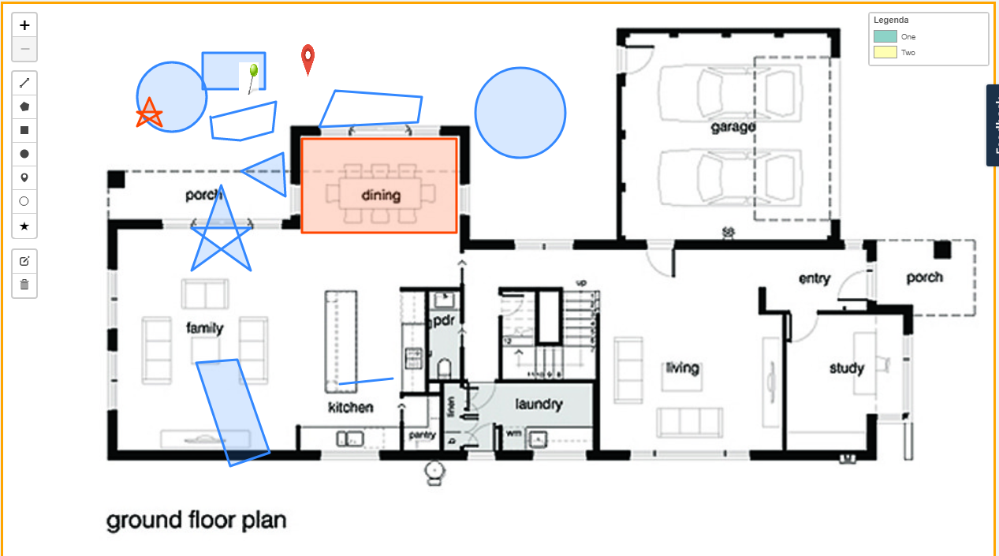
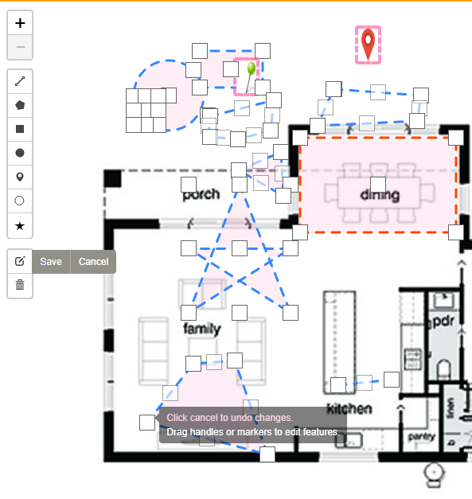
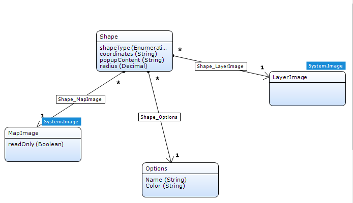
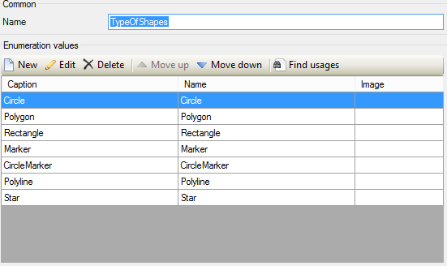

# LeafletWidget
This code used for "MapMarkerEditor Application" by using LeafletJS.

### Overview

This is the code for [this](https://appstore.home.mendix.com/link/app/105748/SCH/MapMarkerEditor) application on Mendix Appstore by using LeafletJS.

### Description

This widget allows you to create a map based on arbitrary image background, for example: house plan, main board, or machine drawing. It is also able to add any customize markers such as image markers, vector makers.

Feature:
- Create map from any image background
- Drag and drop (custom) markers on the map
- Edit makers
- Full map control functionalities
- Customize context menu on marker and action on click on marker

### Configuration

After download from Appstore, place the widget into a dataview since it's required to have context for the widget.

The widget is designed to support many possiblities of editting on the image but you can start with minimum settings to quickly have working version and adding the rest feature later. All required configs ared mandatory, without them, you will get error in Modeller.

 1. Map image(entity, required):This is the startpoint of everything, this entity should also be the entity of the dataview.
    1.1 Readonly mode (attribute, boolean, optional, required): If true, the map image is in readonly mode, you cannot create/edit any shapes.
    1.2 Min zoom(number, required):Set min zoom of the map.
    1.3 Max zoom(number, required):Set max zoom of the map.
    1.4 Zoom level(number, required):Set zoom level when starting.
    1.5 Latitude starting(number, required):Set latitude of the view when starting.
    1.6 Longitude starting(number, required):Set longitude of the view when starting.
 2. Shape(entity, required):A map image contains multiple shape.
    2.1 Type of shape(enumeration, required):The shape enumeration to identify kind of the shape.
    Prequisitive:
    The enum must config look like this, if not, you will get error.

    2.2 Shape-map image relation(association, required):The association from shape to map image. We use this one to retrieve all shapes connected to the contextObject.
    2.3 Shape-options relation(association, required):The association from shape to options. We use this one to retrieve the options which shapes belong to.
    2.4 Shape coordinates(attribute, string, required):Coordinates of the shape.
    2.5 Shape popup content(attribute, string, required):Content of the shape's popup.
    2.6 Radius(attrivute, decimal, required):Size of the radius if shape is a circle. 
    2.7 Shape-layer image relation(association, required):The association from shape to layer image. If shape is a marker, we use this one to retrieve the image which shapes belong to.

 3. Layer image(entity, required):The layer image entity contraint with marker shapes.

 4. Options(entity, required):The options entity contraint with shapes.
    4.1 Color of the options.

 5. Form context menu(form): If this property is set, the form will be showed when click on the open form of the context menu.
    5.1 Shape context menu(microflow): The list of the microflow will be added into context menu, and these microflow will be called when click on the context menu.

 6. Show popup(boolean): If true, the popup will be showed when left click on the layer.
    6.1 Form edit(form): If this property is set, the select form will be showed when left click on the layer.
    6.2 Microflow(microflow): If this property is set, the select microlflow will be called when left click on the layer.